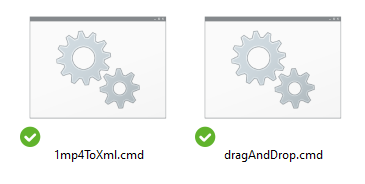

# PrAutoEditorScript


## Описание

Полезный bat скрипт для создателей видео контента!

При помощи библиотеки [auto-editor](github.com/wyattblue/auto-editor) - автоматически вырезаются тихие участки в отснятом видео.

И при использовании спец команд библиотеки - подготавливается `xml файл` с проектом, для дальнейшего экспорта в `Adobe Premiere Pro`.

По умолчанию мы каждый раз пишем макрос в `[cmd] командную строку Windows`.

Данный репозиторий даёт вам скрипт, чтоб можно было тупо
перетаскивать видео на bat скрипт при помощи технологии (Drag & drop)!

---

## Установка `auto-editor`

- Стоит Python ?
    - cmd
    - `pip install auto-editor`
- Не стоит Python ?
    - Ставим Python python.org/downloads/
    - Изучаем самостоятельно github.com/wyattblue/auto-editor
    - Смотрим видео youtu.be/X02QkrWPZw8

> Проверить версию auto-editor `auto-editor -V`

> Обновить auto-editor `pip install auto-editor --upgrade`

> История версий:
> 23w15a 23 15 1
> 23w20b 23 20 2

---

## Использование


- `dragAndDrop.cmd`

---

## Рекомендации

Хорошо сочетается вместе с [YouTube-chapter-creator-helper](https://github.com/gitalexhubuser/YouTube-chapter-creator-helper)

---

# Скрипты



## Простой скрипт

```bash
# Чтоб воспользоватся - переименуй видео файл в 1.mp4
auto-editor "1.mp4" --export premiere --margin 0.2sec
```

> 1mp4ToXml.cmd

---

## С использованием `Drag & drop`

```bash
@echo off

REM Проверяем, был ли указан файл в аргументах командной строки
if "%~1"=="" (
    echo Вы не перетащили файл на скрипт.
    pause
    exit /b
)

REM Проверяем, существует ли указанный файл
if not exist "%~1" (
    echo Файл %~1 не существует.
    pause
    exit /b
)

REM Ваш код с использованием перетащенного файла
auto-editor "%~1" --export premiere --margin 0.2sec

pause

```

> dragAndDrop.cmd

> `Актуальный скрипт`, который [я](https://www.youtube.com/channel/UCjDdSdLJbbV0UBtzKpClmig) использую!!!

---

# Ссылки
| Описание | Ссылка |
| ------ | ------ |
Репо: | [github.com/gitalexhubuser/PrAutoEditorScript](https://github.com/gitalexhubuser/PrAutoEditorScript)
